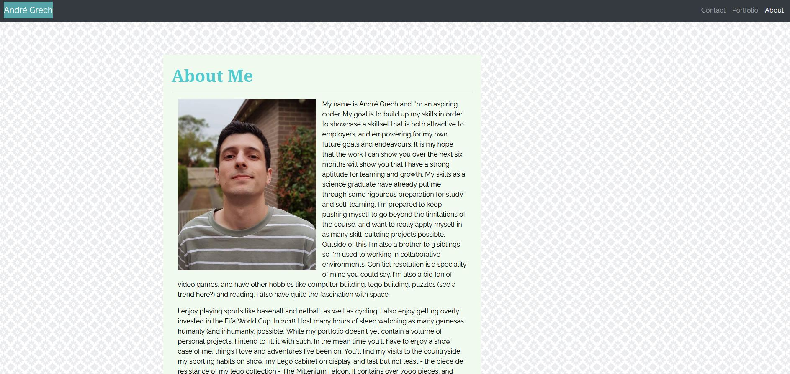

# Unit 02 Responsive Portfolio

Responsive design ensures that web applications render well on a variety of devices and window or screen sizes. As a developer, I will likely be asked to create a mobile-first application or add responsive design to an existing application. This portfolio aims to show off some of the work i've completed thus far and give you some insight into me.

## Contents

- `index.html`, `portfolio.html` and `contact.html` files for a personal portfolio website

- Image assets sourced under creative commons license and personal images not for public distribution.

### Code

- Structure and layout sourced from bootstrap documentation and examples. Further changes made to suit brief specification and grid layout.

#### Tools 

- [VScode](https://code.visualstudio.com/) - The editor of choice.
- [jQuery](https://api.jquery.com/)
- [Bootstrap](https://getbootstrap.com/)

### Sample of deployed application

_Snapshot of deployed index.html page_

### Minimum Requirements

- Functional, deployed application

- GitHub repository with README describing the project

- Navbar must be consistent on each page.

- Navbar on each page must contain links to Home/About, Contact, and Portfolio pages.

- All links must work.

- Must use semantic html.

- Each page must have valid and correct HTML. (use a validation service)

- Must contain your personalized information. (bio, name, images, links to social media, etc.)

- Must properly utilize Bootstrap components and grid system.

### Authors

- Original code by bootstrap used as framework
- Added code by \_Andr&eacute; Grech - 27/8/2020

#### License

- [MIT License](https://opensource.org/licenses/MIT)

#### Acknowledgements

- © 2019 Trilogy Education Services, a 2U, Inc. brand. All Rights Reserved.
